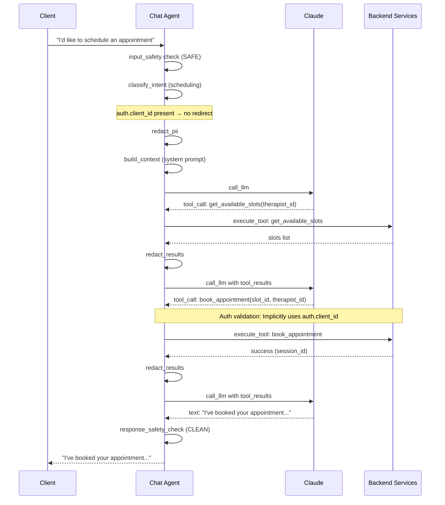
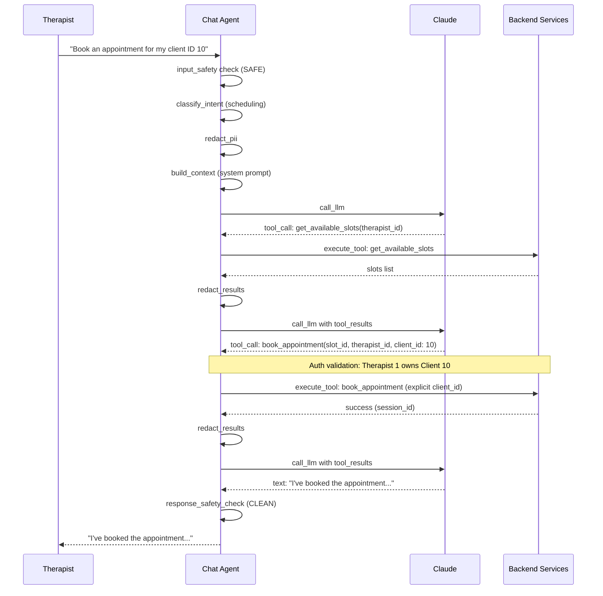
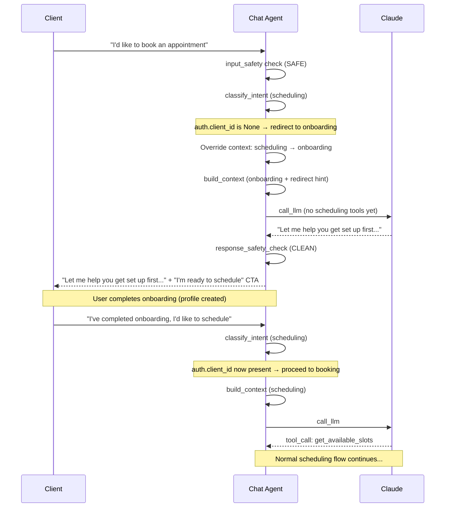
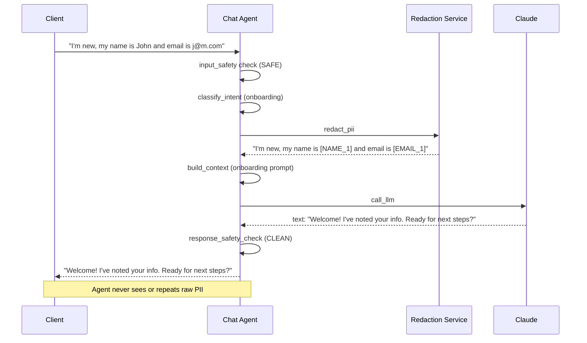
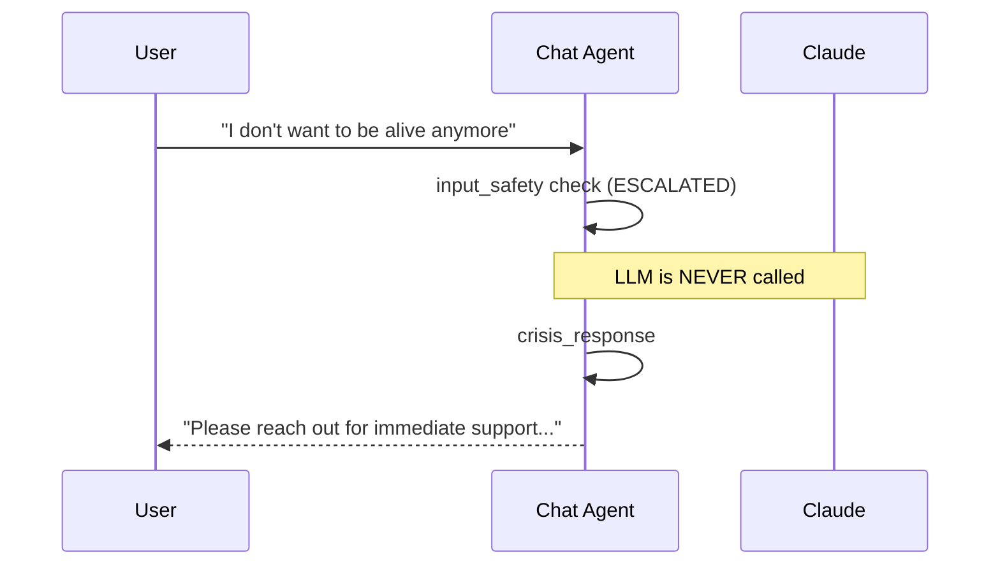
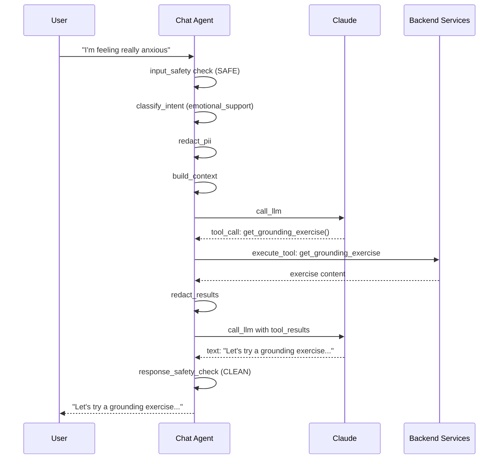

# Chat Agent Flow Graph

This document maps the chat agent's processing pipeline as a directed graph. It is designed to inform a LangGraph implementation where each stage becomes a node and edges represent transitions with conditional routing.

**Implementation:** The pipeline is implemented in Rails (`backend_rails/app/services/agent_service.rb`) as a sequence of service objects: `InputSafetyService` → `RedactionService` → `ContextBuilder` → `LlmService` (+ tool loop) → `ResponseSafetyService`.

---

## High-Level Graph

```
                    ┌──────────┐
                    │  START   │
                    │ (input)  │
                    └────┬─────┘
                         │
                         ▼
                ┌────────────────┐
                │  input_safety  │
                │   check        │
                └───┬────────┬───┘
            ESCALATED│       │SAFE
                     ▼       ▼
          ┌──────────────┐  ┌──────────────────┐
          │ crisis_      │  │ classify_intent   │
          │ response     │  └────────┬─────────┘
          └──────┬───────┘           │
                 │                   ▼
                 │          ┌──────────────────┐
                 │          │  redact_pii      │
                 │          └────────┬─────────┘
                 │                   │
                 │                   ▼
                 │          ┌──────────────────┐
                 │          │ build_context     │
                 │          │ (system prompt +  │
                 │          │  tools + history) │
                 │          └────────┬─────────┘
                 │                   │
                 │                   ▼
                 │          ┌──────────────────┐
                 │          │  call_llm        │◄────────────┐
                 │          └───┬──────────┬───┘             │
                 │     NO_TOOLS │          │ HAS_TOOLS       │
                 │              ▼          ▼                  │
                 │              │   ┌─────────────────┐      │
                 │              │   │ execute_tools    │      │
                 │              │   └───┬─────────┬───┘      │
                 │              │       │         │           │
                 │              │  ERROR│    OK   │           │
                 │              │       ▼         ▼           │
                 │              │  ┌─────────┐  ┌──────────┐ │
                 │              │  │ tool_   │  │ redact_  │ │
                 │              │  │ error   │  │ results  ├─┘
                 │              │  └────┬────┘  └──────────┘
                 │              │       │     (loop back to call_llm,
                 │              │       │      up to MAX_TOOL_ROUNDS=5)
                 │              ▼       │
                 │          ┌───────────┴───┐
                 │          │ response_     │
                 │          │ safety_check  │
                 │          └──┬─────────┬──┘
                 │      FLAGGED│         │CLEAN
                 │             ▼         │
                 │     ┌────────────┐    │
                 │     │ safe_      │    │
                 │     │ deflection │    │
                 │     └─────┬──────┘    │
                 │           │           │
                 │           ▼           ▼
                 │        ┌─────────────────┐
                 │        │ append_actions  │
                 │        │ + disclaimer    │
                 │        └───────┬─────────┘
                 │                │
                 ▼                ▼
              ┌─────────────────────┐
              │        END          │
              │ (AgentChatResponse) │
              └─────────────────────┘
```

---

## Node Definitions

### `input_safety`
- **Input:** Raw user message
- **Output:** `SafetyMeta` (flagged, escalated, flag_type)
- **Routing:** `ESCALATED` → `crisis_response` | `SAFE` → `classify_intent`
- **Implementation:** Regex pattern matching against crisis language (suicidal ideation, self-harm, harm to others)
- **File:** `backend_rails/app/services/input_safety_service.rb`, `backend_rails/app/services/safety_scanner.rb`

### `crisis_response`
- **Input:** Original message + safety metadata
- **Output:** Hardcoded crisis response with resources (988 Lifeline, Crisis Text Line)
- **Routing:** → `END` (LLM is never called)
- **File:** `backend_rails/app/services/agent_service.rb`

### `classify_intent`
- **Input:** User message text
- **Output:** `AgentContextType` enum
- **Routing:** Always → `redact_pii` (after optional onboarding redirect)
- **Logic:** Keyword-based regex matching

| Keywords detected | Context type |
|---|---|
| "book", "schedule", "appointment", "cancel" | `scheduling` |
| "new", "register", "intake" | `onboarding` |
| "anxious", "scared", "stressed", "overwhelmed" | `emotional_support` |
| "upload", "insurance", "photo", "scan" | `document_upload` |
| (none) | `general` (default) |

**Onboarding redirect:** If intent is `scheduling` and user is a client with no Client profile (`auth.client_id` is None), the effective context is overridden to `onboarding`. The LLM receives a system prompt addition instructing it to guide onboarding first; suggested actions include "I'm ready to schedule" so the user can return to booking after onboarding.

- **File:** `backend_rails/app/services/agent_service.rb`

### `redact_pii`
- **Input:** User message
- **Output:** Redacted text + server-side mapping
- **Routing:** Always → `build_context`
- **Patterns:** Names, emails, phones, SSNs, dates of birth, policy/member IDs, addresses
- **Invariant:** Mapping stored server-side only, never sent to LLM
- **File:** `backend_rails/app/services/redaction_service.rb`

### `build_context`
- **Input:** Context type, redacted message, conversation history
- **Output:** Complete LLM prompt (system prompt + messages + tool definitions)
- **Routing:** Always → `call_llm`
- **System prompts by context type:**
  - `onboarding` — Guide step-by-step, explain what to expect
  - `scheduling` — Help find times, walk through booking
  - `emotional_support` — Validate feelings, use support tools
  - `document_upload` — Guide upload process
  - `general` — Supportive assistant
- **File:** `backend_rails/app/services/agent_service.rb`

### `call_llm`
- **Input:** System prompt, message history, tool definitions
- **Output:** Text blocks + optional tool_use blocks
- **Routing:** `HAS_TOOLS` → `execute_tools` | `NO_TOOLS` → `response_safety_check`
- **Model:** Claude Haiku (haiku-4-5-20251001), max_tokens=1024
- **File:** `backend_rails/app/services/agent_service.rb`

### `execute_tools`
- **Input:** Tool call(s) from LLM response + auth context
- **Output:** Tool results (or error)
- **Routing:** `OK` → `redact_results` → `call_llm` (loop) | `ERROR` → `response_safety_check`
- **Max iterations:** 5 (`MAX_TOOL_ROUNDS`)

#### Available Tools

| Tool | Category | Auth required | Side effects |
|---|---|---|---|
| `get_current_datetime` | Utility | No | None |
| `get_available_slots` | Scheduling | No | None (read-only) |
| `book_appointment` | Scheduling | **Yes** | Creates Session record |
| `list_appointments` | Scheduling | **Yes** | None (read-only; returns cancellable sessions) |
| `cancel_appointment` | Scheduling | **Yes** | Updates Session status |
| `get_grounding_exercise` | Emotional support | No | None |
| `get_psychoeducation` | Emotional support | No | None |
| `get_what_to_expect` | Emotional support | No | None |
| `get_validation_message` | Emotional support | No | None |

#### Auth Validation (scheduling mutations)
- **Client role:** `client_id` from JWT; can only act for self
- **Therapist role:** `client_id` from tool input; server validates `Client.therapist_id == Therapist.id`

- **Files:** `backend_rails/app/services/agent_tools.rb`, `backend_rails/app/services/scheduling_service.rb`, `backend_rails/app/services/emotional_support_service.rb`

### `response_safety_check`
- **Input:** LLM response text
- **Output:** Original or replaced text + flag metadata
- **Routing:** `FLAGGED` → `safe_deflection` → `append_actions` | `CLEAN` → `append_actions`
- **Patterns checked:**
  - Diagnosis ("you have depression", "consistent with...")
  - Medication advice (specific drug + dosage)
  - Medical advice ("stop taking your meds")
- **File:** `backend_rails/app/services/response_safety_service.rb`, `backend_rails/app/services/safety_scanner.rb`

### `append_actions`
- **Input:** Response text, context type
- **Output:** `AgentChatResponse` with suggested actions + disclaimer
- **Routing:** → `END`
- **Suggested actions vary by context type:**
  - `scheduling`: "Find available times", "Reschedule", "Cancel"
  - `onboarding`: "Start onboarding", "Upload document", "What do I need?"
  - When redirected from scheduling to onboarding, an extra action "I'm ready to schedule" is appended.
  - `emotional_support`: "Talk to someone", "Breathing exercise", "Schedule session"
  - `document_upload`: "Upload insurance", "Upload ID", "What docs needed?"
  - `general`: "Get started", "Schedule"
- **File:** `backend_rails/app/services/agent_service.rb`

---

## State Schema (for LangGraph)

```python
from typing import TypedDict, Optional
from enum import Enum

class AgentContextType(str, Enum):
    general = "general"
    onboarding = "onboarding"
    scheduling = "scheduling"
    emotional_support = "emotional_support"
    document_upload = "document_upload"

class ChatState(TypedDict):
    # Input
    raw_message: str
    conversation_id: Optional[str]
    auth_context: dict              # user_id, role, client_id, therapist_id

    # Safety
    safety_flagged: bool
    safety_escalated: bool
    safety_flag_type: Optional[str]

    # Processing
    context_type: AgentContextType
    redirected_from_scheduling: bool   # True when client without profile asked to schedule
    redacted_message: str
    pii_mappings: dict              # server-side only
    system_prompt: str
    messages: list                  # LLM conversation history
    tool_definitions: list

    # Tool loop
    tool_round: int                 # current iteration (0-4)
    tool_results: list              # latest tool execution results

    # Output
    response_text: str
    response_flagged: bool
    suggested_actions: list
    final_response: dict            # AgentChatResponse
```

---

## Conditional Edges

```python
def route_after_safety(state: ChatState) -> str:
    """After input_safety node."""
    if state["safety_escalated"]:
        return "crisis_response"
    return "classify_intent"

def apply_onboarding_redirect(state: ChatState) -> None:
    """After classify_intent. Override context if client without profile wants to schedule."""
    if (state["context_type"] == "scheduling" and
        state["auth_context"].get("role") == "client" and
        state["auth_context"].get("client_id") is None):
        state["context_type"] = "onboarding"
        state["redirected_from_scheduling"] = True

def route_after_llm(state: ChatState) -> str:
    """After call_llm node."""
    if state.get("tool_calls"):
        return "execute_tools"
    return "response_safety_check"

def route_after_tools(state: ChatState) -> str:
    """After execute_tools node. Loop or exit."""
    if state["tool_round"] >= 5:
        return "response_safety_check"
    return "call_llm"  # loop back

def route_after_response_safety(state: ChatState) -> str:
    """After response_safety_check node."""
    if state["response_flagged"]:
        return "safe_deflection"
    return "append_actions"
```

---

## Flow Charts (Example Traces)

### Client Appointment Booking (Onboarded Client)
*Assumes client has a Client profile (`auth.client_id` set).*



### Therapist Appointment Booking (Delegation)


### Client Scheduling → Onboarding First (Not Onboarded)
*Client without a Client profile asks to schedule; redirected to onboarding, then back to booking.*



### Client Onboarding


### Crisis (Short-Circuit)


### Emotional Support


---

## Security Mechanisms in the Graph

| Node | Mechanism | Purpose |
|---|---|---|
| `input_safety` | Regex crisis detection | Block self-harm/harm language before LLM |
| `redact_pii` | Token replacement | PII/PHI never reaches Claude |
| `execute_tools` | Auth context validation | Enforce client/therapist boundaries |
| `execute_tools` | Server-side execution only | LLM cannot directly mutate DB |
| `redact_results` | Tool output redaction | Prevent PII leaking back through tool results |
| `response_safety_check` | Output pattern matching | Block diagnosis, medication, medical advice |
